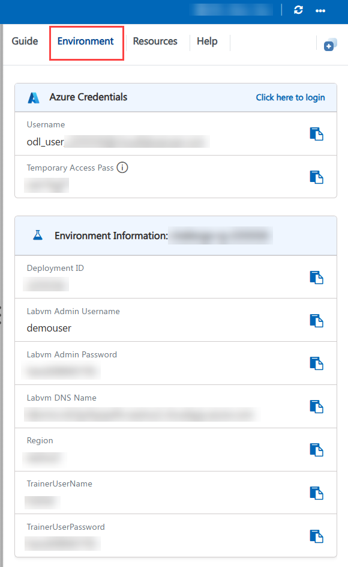
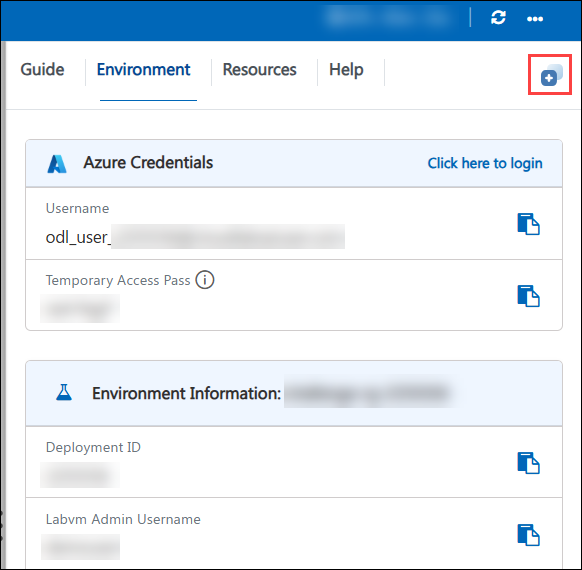
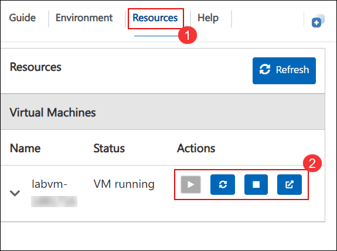
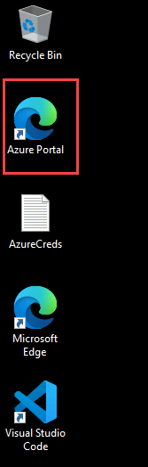
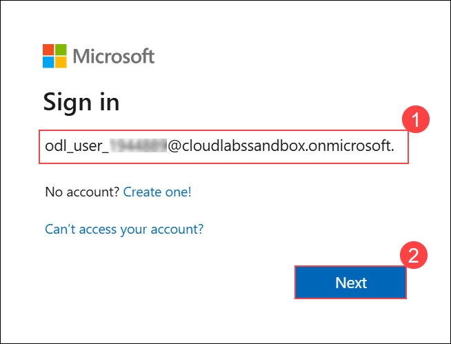
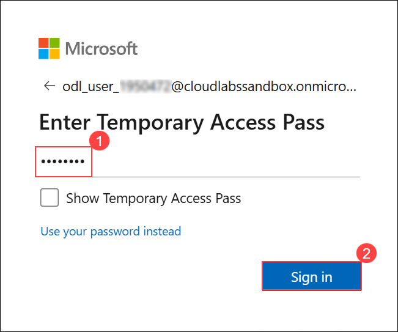
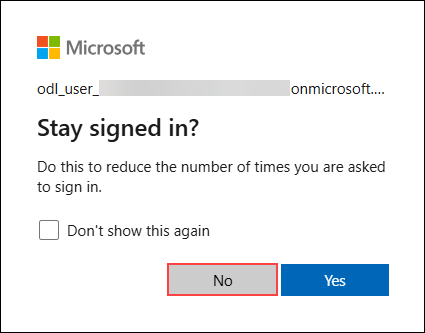

## Getting Started with Challenge

We've prepared a seamless environment for you to explore and learn. Let's begin by making the most of this experience.

### Accessing Your Challenge Environment

Once you're ready to dive in, your virtual machine and challenge guide will be right at your fingertips within your web browser.


### Exploring Your Challenge Resources

To get a better understanding of your challenge resources and credentials, navigate to the Environment tab.



### Utilizing the Split Window Feature

For convenience, you can open the challenge guide in a separate window by selecting the Split Window button from the Top right corner.



### Managing Your Virtual Machine

Feel free to start, stop, or restart your virtual machine as needed from the Resources tab. Your experience is in your hands!



> **Note:** If the VM is not in use, please **deallocate** it to avoid unnecessary resource consumption.

---

## Let's Get Started with Microsoft Azure

1. In the JumpVM, click on **Azure Portal** browser shortcut which is created on the desktop.

   

1. On the **Sign into Microsoft** tab, you will see the login screen. Enter the provided email or username and click **Next** to proceed.

   - Email/Username: <inject key="AzureAdUserEmail"></inject>

     

1. Now, enter the following Temporary Access Pass and click on **Sign in**.

   - Temporary Access Pass: <inject key="AzureAdUserPassword"></inject>

     

1. If you see the pop-up **Stay Signed in?**, click No.

   

---

## Prepare Your Document Corpus

Before starting the challenge, you need a representative set of enterprise documents to work with. These will form the knowledge base your copilot will operate over.

1. Prepare or source a collection of at least **10 documents** covering at least **three distinct document categories**. Suggested categories include:

   - HR policies (leave policy, code of conduct, travel reimbursement policy)
   - IT and security standards (acceptable use policy, data classification standard, incident response procedure)
   - Procurement and vendor contracts (standard vendor agreement, SLA template, purchase order policy)

   > **Note:** You may use publicly available sample enterprise documents, generate representative synthetic documents, or use any organizational content appropriate for this exercise. Documents should be in PDF, Word, or Excel format.

1. Organize your documents into category-based folders locally. This folder structure will map to the container structure you create in Azure Blob Storage during the challenge.

1. Ensure your document set contains at least two documents within one category that represent **different versions or variants of a policy or contract** - these will be used for the comparison objective in the challenge.

---

## Verify Access to Required Services

Confirm you can access all services that will be used during the challenge before you begin:

1. From the Azure Portal, verify that the following resources are present in your assigned resource group:

   - Azure Storage Account
   - Azure AI Search instance
   - Azure AI Foundry workspace (or confirm you can create one)
   - Azure Document Intelligence resource

1. Open a new browser tab and navigate to Microsoft Copilot Studio:

   ```
   https://copilotstudio.microsoft.com
   ```

   Sign in with the provided credentials and confirm access is granted.

1. Open another browser tab and navigate to Power Automate:

   ```
   https://make.powerautomate.com
   ```

   Sign in and confirm access to Premium connectors is available under your license.

1. Navigate to Microsoft AI Foundry:

   ```
   https://ai.azure.com
   ```

   Sign in and confirm the pre-provisioned Foundry project is visible, or confirm you have permission to create a new project.

   > **Note:** If any service access is unavailable, navigate to the Environment tab in your challenge portal to retrieve alternate credentials or contact CloudLabs support.

---

Now, click on the **Next** from the lower right corner to move on to the challenge.

## Happy Hacking!!
